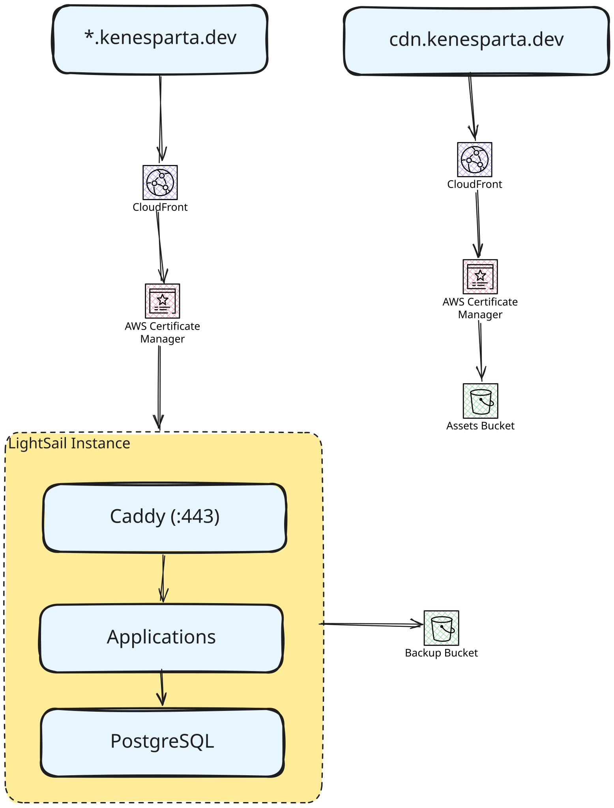

# personal-infra

Terraform + Ansible for a single-host application server on AWS Lightsail, and the consolidated Terraform state for the
whole `kenesparta.dev` AWS account.

Up to four containerized Rust services share one instance behind Caddy, with a self-hosted PostgreSQL and off-host
backups. Images are built by GitHub Actions, published to GHCR, and **pulled** by a systemd timer — nothing pushes to
this host.

> **[`spec/`](spec/) is the source of truth.** It records every architecture decision, what was rejected, and why —
> one file per numbered section, indexed by [`spec/README.md`](spec/README.md). Read it before changing anything; if you
> find a gap, amend the spec first, then implement. This README is the operator's entry point, not the design.

---

## Status: migrated — in production

All phases 0–9 were applied and verified on 2026-07-27; [`spec/10-phases.md`](spec/10-phases.md) carries as-executed
annotations where reality diverged from the plan. The instance serves both projects in production —
`kenesparta.dev` (blog) and `api.kenesparta.dev` (budget API, backend of the iOS app; through rev 2.5 it was the
budget Telegram bot at `bot.kenesparta.dev`) — each behind its own CloudFront distribution →
Caddy (Let's Encrypt) → container, with the data restored into the host Postgres.

The old estate is gone: the Lightsail Container Service, the ECR repositories, the managed PostgreSQL and the old
`../kenesparta.dev/tf` and `../budget-assistant/deploy/tf` directories are destroyed or deleted, and this repository's
state (`s3://tf.kenesparta.dev/infra/prod/terraform.tfstate`) is the account's **only** live Terraform. The host is
Ubuntu-Pro-attached and CIS Level 1 hardened — via the G18-tailored profile only, never the stock one.

The backup path is proven end-to-end: dumps upload nightly to `s3://kenesparta-infra-backups/postgres/<db>/`, and a
bucket → scratch-database restore was rehearsed on 2026-07-27 with row-for-row parity (Phase 9). The final
pre-migration dumps live at `s3://kenesparta-infra-backups/managed-db-final/`; the pre-hardening rollback snapshot is
`pre-harden-2026-07-27`.

The cutover never touched DNS: the apex `A ALIAS → CloudFront` record was constant throughout, so Phase 6 was a
CloudFront **origin swap** — and rollback remains the same one-line change in reverse.

---

## Architecture



**Why two certificates.** An ACM certificate can never be installed on a Lightsail instance — standard ACM public certs
are non-exportable, and Lightsail's own certificate service attaches only to load balancers, container services and CDN
distributions. So ACM terminates at CloudFront and Caddy holds a separate Let's Encrypt cert for the origin. See spec
AD-8 and G2.

**Why one distribution per project.** CloudFront routes by path pattern, not by `Host`, so a single distribution cannot
fan several hostnames out to several backends. Distributions are billed per request and per GB, not per distribution, so
this costs nothing extra.

**Why the origin is publicly reachable.** Lightsail firewalls take plain CIDR lists and cannot reference CloudFront's
`origin-facing` managed prefix list, whose ranges rotate. The origin is gated at the application layer instead — Caddy
403s anything without the shared `X-Origin-Verify` header (G11).

**The static CDN is separate.** `cdn.kenesparta.dev` serves fonts, images and the CV from S3 through its own
distribution (`terraform/static-cdn.tf`), written to by the typst-resume repo's CI role — no part of the host is
involved. Browser caching splits by path: `fonts/*` and `blog/*` are filename-versioned, write-once, and carry
`Cache-Control: public, max-age=31536000, immutable` — replacing an asset there means renaming it — while everything
else (the CV, `img/*`) is overwritten in place and stays on a five-minute default that defers to per-object metadata.
See spec §4 and G19 before touching any of it.

---

## Prerequisites

| Tool             | Why                                                      |
|------------------|----------------------------------------------------------|
| Terraform ≥ 1.10 | Native S3 state locking (`use_lockfile`); CI pins 1.15.8 |
| AWS CLI v2       | SSO login, state seeding, Lightsail lookups              |
| Ansible          | Host configuration                                       |
| `sops` + `age`   | Decrypts `secrets/prod.enc.env`                          |

Also needed:

- **age private key** at `~/.config/sops/age/keys.txt` (the Makefile exports `SOPS_AGE_KEY_FILE` to point there)
- **SSH keypair** at `~/.ssh/personal-infra` / `.pub` — the public half is authorized on the instance

```bash
cp terraform/.env.example terraform/.env               # SSO profile
cp terraform/terraform.tfvars.example terraform/terraform.tfvars
# set ssh_allowed_cidrs:  curl -s https://checkip.amazonaws.com
make login
```

`ssh_allowed_cidrs` must never contain `0.0.0.0/0`; a variable validation rejects it, because the firewall resource is
authoritative and a wildcard there exposes SSH globally.

---

## Running it

```bash
make help          # list targets
```

### Terraform — the edge and the host

```bash
make login         # AWS SSO — it expires; run before any plan or apply
make plan          # writes tf.plan; read it before applying
make apply         # applies the saved tf.plan
```

Read the plan before applying. A plan that wants to **replace the instance** is data loss, not a change (`user_data`
is `ForceNew` — see below). A plan that wants to **destroy** anything deserves the same suspicion: this state owns the
Route 53 zones, their DNSSEC keys, and the KMS keys (G10).

`make state/seed` and `make plan/phase0` are historical. The Phase 0 state-copy gate passed on 2026-07-27, and since
the Phase 6 origin swap it can no longer report clean — the target now prints a notice saying exactly that. Resource
addresses were preserved by copying the state object, which is why there are no `import` blocks anywhere in this repo.

Host snapshots are **weekly**: Sundays 06:00 UTC an EventBridge rule fires the `kenesparta-host-weekly-snapshot`
Lambda, which creates `kenesparta-host-weekly-<date>` and prunes to the newest four by name prefix (spec §5.8). The
daily AutoSnapshot add-on is disabled — it cannot do weekly — and what the Lambda makes are *manual* snapshots, which
never expire on their own; the prune is the only thing bounding their cost, and it never touches names outside the
prefix, so `pre-harden-*`-style snapshots are safe (G20).

`terraform/.terraform.lock.hcl` **is committed** — deliberately. Provider determinism is what kept the migration's
zero-diff gate honest, and it still matters: `carlpett/sops` is constrained only to `~> 1.2`, and the lock file is the
only thing actually pinning it to 1.4.1 (`aws` is pinned to `6.15.0` in `versions.tf`). It carries hashes for both
`darwin_arm64` and `linux_amd64`, so an `init` from Linux won't fail on a missing checksum. After changing a provider
version:

```bash
terraform -chdir=terraform providers lock -platform=darwin_arm64 -platform=linux_amd64
```

Resizing or rebuilding the instance? Verify blueprint and bundle IDs first — they change over time, and Lightsail
supports only a subset of AZs:

```bash
aws lightsail get-blueprints --query 'blueprints[?platform==`LINUX_UNIX`].[blueprintId,name]' --output table
aws lightsail get-bundles    --query 'bundles[].[bundleId,ramSizeInGb,price]' --output table
aws lightsail get-regions --include-availability-zones --query 'regions[?name==`us-east-1`].availabilityZones[].zoneName'
```

### Ansible — host configuration

```bash
make deps          # install community.docker (once per workstation)
make vault/create  # group_vars/vault.yml from the committed template, then fill it in
make check-ssh     # ansible -m ping
make configure     # site.yml — everything except hardening
make configure     # ...again: the second run must report 0 changed (acceptance criterion 2)
make harden        # harden.yml — SNAPSHOT FIRST; runs usg fix with the G18 tailoring only
```

`make inventory` regenerates `ansible/inventory/hosts.ini` from `terraform output -raw static_ip`. Terraform owns the
IP; Ansible reads it. It is deliberately *not* a `local_file` resource — that would put a generated local file under
state management and couple `terraform destroy` to Ansible's working tree.

The first `make check-ssh` on a new instance **will refuse to connect**: `host_key_checking` is on and the host is not
in `known_hosts` yet. That is the control working. Compare the fingerprint against the Lightsail console, then:

```bash
ssh-keyscan -H "$(terraform -chdir=terraform output -raw static_ip)" >> ~/.ssh/known_hosts
```

One credential must be created by hand before `make configure` succeeds: a **GHCR PAT** with `read:packages` and nothing
else, into `vault_ghcr_token`. It is not a Terraform resource because a PAT is a GitHub credential, and AD-10 exists
precisely so the host holds one credential instead of a refreshing ECR token.

The backup path needs **no credential at all**. Lightsail buckets support *resource access* — the service's equivalent
of an EC2 instance profile — so `terraform apply` attaches the instance to the bucket and the AWS CLI resolves
short-lived credentials from instance metadata. Nothing to store, nothing to rotate; revoking is detaching the instance.
`make configure` proves it works with an `aws s3 ls` at configure time rather than letting you find out at 03:00.

That convenience has a sharp edge, and the `docker` role blunts it: metadata is reachable from *any* container on a
Docker bridge, so without intervention a compromised application container could read the same credentials and help
itself to every project's database dumps. The guard is a **native nftables** table of its own, dropping traffic to
`169.254.169.254` at the `forward` hook — the path containers use and the host does not, so `pg-backup.sh` keeps
working. See G5 and G16; do not remove it.

```bash
ssh ubuntu@HOST sudo nft list table inet personal_infra_guard   # the rule, and its packet counter
```

`iptables -S` will **not** show it. That is not a bug — it lives in its own table rather than in Docker's `DOCKER-USER`
chain, which is what makes it survive Docker rebuilding its firewall on every daemon start and lets it be ordered
*before* `docker.service` instead of after. Also: never enable Ubuntu's `nftables.service` — its stock
`/etc/nftables.conf` starts with `flush ruleset` and would wipe Docker's rules.

#### What the roles own

| Role        | Produces                                                                                                                   |
|-------------|----------------------------------------------------------------------------------------------------------------------------|
| `common`    | apt cache, base packages, `unattended-upgrades` (security only, never auto-reboots), UTC, `fail2ban`                       |
| `docker`    | Engine + Compose from Docker's apt repo, log rotation, `live-restore`, the `web` network, GHCR login, metadata guard (G16) |
| `postgres`  | One `postgres:18` container on `web`, no published port, tuned for 2 GB, one DB + role per project                         |
| `caddy`     | The only container publishing host ports; templated Caddyfile, LE certs, the origin gate                                   |
| `deploy`    | Per-project Compose stack, plus `personal-infra-deploy@<name>.timer` pulling from GHCR every 10 min                        |
| `backup`    | `/usr/local/bin/pg-backup.sh` and a daily timer writing timestamped dumps to the Lightsail bucket                          |
| `hardening` | `pro attach`, `pro enable usg`, `usg fix --tailoring-file` with the G18 tailoring — **`harden.yml` only**                  |

Postgres runs as a container rather than an apt package (AD-3). The reason is not preference: applications are
containers on a bridge network, and `127.0.0.1` inside such a container is its own namespace, not the host's — so a
host-installed Postgres bound to loopback is unreachable from precisely the things that need it. As a container on
`web` it is reachable as `postgres:5432` and *nothing* on the host listens on 5432 at all.

#### Useful once it is running

```bash
psql()  { ssh ubuntu@HOST docker exec -it postgres psql -U postgres "$@"; }
ssh ubuntu@HOST sudo systemctl list-timers 'personal-infra-deploy@*' pg-backup.timer
ssh ubuntu@HOST sudo journalctl -u personal-infra-deploy@blog.service -n 50
ssh ubuntu@HOST sudo /usr/local/bin/pg-backup.sh          # force a backup now
```

Rotating a Postgres password is two-sided, like the origin secret: edit `make vault/edit`, then
`make configure -e postgres_rotate_passwords=true` — that ALTERs the role and rewrites the project's `DATABASE_URL` in
the same run. Without the flag the role is created once and its password is never touched again, which is what keeps a
second `make configure` at zero `changed`.

---

## Adding a project

Edit `projects.yml`. One file drives origin DNS records, CloudFront distributions, Caddy vhosts, Postgres databases, and
deploy timers — Terraform reads it with `yamldecode`, Ansible with `vars_files`. Neither tool keeps its own copy.

```yaml
- name: api
  hostname: api.kenesparta.dev       # CloudFront alias (already covered by the wildcard ACM cert)
  origin: origin-api.kenesparta.dev  # A → static IP; must resolve DIRECTLY to the box for HTTP-01
  image: ghcr.io/kenesparta/api
  port: 3001
  database: api
```

A project that nothing connects *to* — the Discord gateway bot, which dials out over WSS and holds the socket — omits
the ingress set entirely. No CloudFront distribution, no alias records, no origin `A` record, no Caddy vhost, no Let's
Encrypt certificate; everything else is identical:

```yaml
- name: cnayp_discord_bot
  image: ghcr.io/kenesparta/cnayp-discord-bot
  database: cnayp_discord_bot       # no hostname / origin / port
  env:
    RUST_LOG: info
```

`hostname`, `origin` and `port` are optional **as a set** — all three or none. `site.yml` rejects a half-specified
entry rather than defaulting the gap, because losing `origin` to a typo would silently drop a vhost and its
certificate, and `.dev` is HSTS-preloaded (a TLS gap is an outage, not a warning). See
[`spec/05-resources.md` §5.3](spec/05-resources.md).

Then add its Postgres password to the vault — the one thing that cannot live in `projects.yml`, since that file is
committed:

```bash
make vault/edit     # vault_postgres_passwords: { api: "<openssl rand -hex 32>" }
make configure
```

`site.yml` refuses to run if any project lacks one, rather than half-configuring the host. Names must be lowercase
`[a-z][a-z0-9_]*` — a project's name becomes a SQL identifier, a container name, a Docker DNS label and a systemd unit
instance, and that character set is safe in all four.

The ceiling is **four services**. RAM is the binding constraint on a 2 GB host: ~350 MB OS + Docker, ~400 MB tuned
Postgres, ~50 MB Caddy, ~100 MB per service. Growing past four means resizing to `medium_3_0`, which is a stop /
change-bundle / start on a snapshot — minutes of downtime, no redesign. `site.yml` asserts the ceiling, so adding a
fifth fails fast instead of discovering it through the OOM killer.

---

## The Discord app's legal pages

Discord requires a Terms of Service URL and a Privacy Policy URL before an application can be verified or listed, and
fetches both itself. `cnayp-bot.kenesparta.dev` serves them from S3 + CloudFront — **not** from the bot, which stays
headless. Putting them on the bot would cost an origin hostname, a Caddy vhost, a Let's Encrypt certificate and one of
the four service slots, and would tie documents Discord fetches to a bot process on a 2 GB box.

Content lives in the [`cnayp-discord-bot`](https://github.com/kenesparta/cnayp-discord-bot) repo and publishes itself
over OIDC — no access key on either side. Four files are required; `404.html` is not optional, because an S3 origin
behind OAC answers a *missing* key with 403 and the distribution maps both 403 and 404 to it:

```
index.html   terms.html   privacy.html   404.html
```

After `make apply`, wire the workflow with:

```bash
make output NAME=cnayp_bot_site_role_arn         # → set as AWS_ROLE_ARN in the bot repo
make output NAME=cnayp_bot_site_bucket
make output NAME=cnayp_bot_site_distribution_id
```

```yaml
# .github/workflows/publish-site.yml in cnayp-discord-bot
on:
  push:
    branches: [main]
    paths: ['site/**']
permissions:
  id-token: write      # required for OIDC; without it the assume-role step fails
  contents: read
jobs:
  publish:
    runs-on: ubuntu-latest
    steps:
      - uses: actions/checkout@v4
      - uses: aws-actions/configure-aws-credentials@v4
        with:
          role-to-assume: ${{ secrets.AWS_ROLE_ARN }}
          aws-region: us-east-1
      - run: aws s3 sync site/ "s3://${{ vars.SITE_BUCKET }}/" --delete
      - run: |
          aws cloudfront create-invalidation \
            --distribution-id "${{ vars.SITE_DISTRIBUTION_ID }}" --paths '/*'
```

The role trusts `main` and tags only. A pull request from a fork presents a `sub` of `repo:...:pull_request`, which
matches neither pattern, so an untrusted PR cannot publish the site.

**Never put these pages behind an immutable cache.** That is G19 in reverse: the CDN's year-long `immutable` header is
safe on filename-versioned assets, but a privacy policy is a stable name overwritten in place, and the entire point of
updating one is that readers see the new text. `immutable` cannot be invalidated out of a browser. This distribution
therefore caches for five minutes (`min_ttl = 0`), and CI holds `CreateInvalidation` so a correction lands in seconds.

---

## Things that will hurt you

Full list in [`spec/12-gotchas.md`](spec/12-gotchas.md). The ones with no undo:

- **Never `terraform destroy` here, and never delete `s3://tf.kenesparta.dev/dns/prod/kenesparta.dev`.** This state
  owns the Route 53 zones, their DNSSEC key-signing keys, and the KMS keys — destroying it breaks **mail delivery to
  the Proton addresses**, not just the websites, and KMS keys enter an unshortenable 7-day deletion window. The old
  `tf/` directory is gone (Phase 7), but that frozen state object is the migration's rollback point (G10) and stays.
- **`user_data` is `ForceNew`.** Editing `terraform/bootstrap.sh` destroys and recreates the instance, databases
  included. It is minimal by design so it never needs to change. Treat any plan showing instance replacement as data
  loss.
- **The firewall resource is authoritative.** `aws_lightsail_instance_public_ports` replaces the entire rule set rather
  than merging. Removing the port 22 block removes SSH.
- **Hardening can lock you out — and the stock profile breaks Docker.** `usg fix` rewrites SSH config, file
  permissions and kernel parameters; run it only through `harden.yml`, which applies the G18 tailoring file. Applied
  bare in Phase 8, `cis_level1_server` flushed Docker's chains and the metadata guard and zeroed `ip_forward` —
  container networking went dark until repaired. Snapshot first, then verify SSH from a *second* terminal before
  closing the first.
- **Let's Encrypt limits are per registered domain** — 50 certs/week shared across every `origin-*` name. Caddy's
  `/data` volume must persist across container recreation, and `.dev` is HSTS-preloaded, so a TLS error makes the site
  unreachable rather than merely degraded. Iterate against LE staging.
- **The origin secret is a two-sided rotation.** It lives in Terraform state (`custom_header`) and Ansible Vault
  (Caddy's comparison). Change Terraform first, then Ansible — the reverse order 403s every request in the gap.
- **The CDN's `immutable` header cannot be taken back.** `fonts/*` and `blog/*` are browser-cached for a year;
  replacing an asset there means renaming it, and a CloudFront invalidation cannot reach a browser that already holds
  it. Stable-name objects overwritten in place — the CV, `img/*` — must stay off those paths, and an asset must exist
  *before* anything references it, or the 403 gets pinned too (G19).

---

## Secrets

Two mechanisms, deliberately not merged:

- **sops + age** — `secrets/prod.enc.env`, committed encrypted, read by Terraform's sops provider. Copied from the
  application repo; same age recipient, so it decrypts identically.
- **ansible-vault** — `ansible/group_vars/vault.yml` holds the Postgres passwords, the GHCR PAT and the origin secret.
  `vault.yml.example` is the committed template and carries key names only. There is deliberately no AWS credential in
  it: the backup uses Lightsail resource access instead (G5).

```bash
make vault/create   # from the template, then encrypt
make vault/edit     # $EDITOR on the decrypted contents
make vault/check    # confirm it is encrypted, not plaintext (run before committing)
```

The vault password comes from `~/.config/personal-infra/vault-pass` when that file exists, and is prompted for
otherwise — so `make configure` works unattended on your machine and safely on a fresh clone.

No secret is ever a Terraform output, and none may appear in `terraform.tfvars.example`.

### Working with `secrets/prod.enc.env`

Go through `make` rather than `sops` directly — the Makefile pins `SOPS_AGE_KEY_FILE`, which does not match sops'
default on macOS. `make help` lists these under *Secrets*; `SECRETS_FILE=…` targets a different file.

```bash
make secrets/check                  # encrypted? decryptable here? — pre-flight for `make plan`
make secrets/keys                   # key names only, no values
make secrets/get KEY=DATABASE_URL   # one value
make secrets/show                   # the whole file, decrypted, to stdout

make secrets/edit                   # $EDITOR on the plaintext; re-encrypts on save
make secrets/set KEY=ORIGIN_VERIFY_SECRET
make secrets/unset KEY=OLD_THING
```

`secrets/set` takes the value on **stdin**, never on the command line — hidden prompt at a terminal, piped input
otherwise — so a secret never reaches shell history or `ps`.

### Changing who can decrypt

Recipients live in `.sops.yaml`, but editing it alone changes nothing: the file's data key has to be re-encrypted
afterwards.

```bash
make secrets/recipients                 # who can decrypt, and whether your key is among them
make secrets/recipient-add AGE=age1…    # then:  make secrets/updatekeys
make secrets/recipient-rm  AGE=age1…    # then:  make secrets/updatekeys && make secrets/rotate
```

Removal needs both. `updatekeys` only drops the key from the file's metadata — the removed holder already knows the data
key of every committed version, and `secrets/rotate` (a *new* data key) is what actually revokes access.

---

## Where things live

| File                      | Contains                                                                                      |
|---------------------------|-----------------------------------------------------------------------------------------------|
| `spec/`                   | Source of truth — decisions, rejected alternatives, phases, gotchas (index: `spec/README.md`) |
| `CLAUDE.md`               | Guidance for Claude Code sessions                                                             |
| `projects.yml`            | The project fan-out, shared by both tools                                                     |
| `terraform/main.tf`       | The instance, static IP, firewall, snapshots                                                  |
| `terraform/cloudfront.tf` | Per-project distributions and the origin-secret header                                        |
| `terraform/static-cdn.tf` | `cdn.kenesparta.dev` — bucket, distribution, the split cache policies (G19)                   |
| `terraform/snapshot-weekly.tf` | Sunday snapshot Lambda + EventBridge rule; the add-on is disabled (G20)                  |
| `terraform/storage.tf`    | The backup bucket — its access key deliberately not in state                                  |
| `ansible/site.yml`        | Everything except hardening; `harden.yml` is separate on purpose (A4)                         |
| `ansible/roles/`          | `common` `docker` `postgres` `caddy` `deploy` `backup` `hardening`                            |
